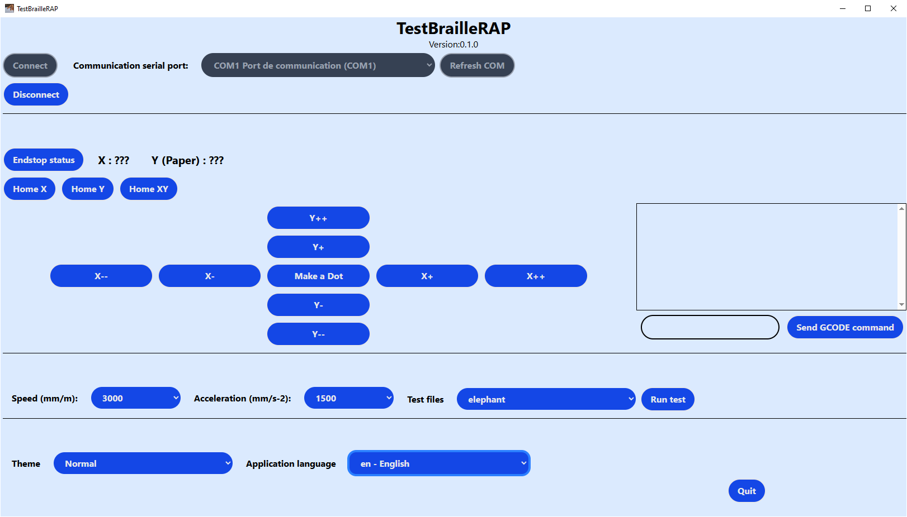

# TestBrailleRAP

Testing tool for BrailleRAP device. You can use it to validate a new built BrailleRAP or to diagnose a malfunction

*A screenshot of TestBrailleRAP*

## Features

* Connexion / Deconnexion
* Homing
* Endstop display
* Move axis
* Activate solenoid
* Set Speed and Acceleration
* Run predeterminate test gcode files for validation and diagnostic
* ...

# Releases

TestBrailleRAP is in active development for now. Pre-built binaries are not yet available

# Contributing

## Translation
If you need the software in your locale language, we will be happy to add a new translation. Translation files will be hosted on codeberg community translation platform and can be updated by anyone [weblate host on codeberg](https://translate.codeberg.org) for more information.

## Code and features
Feel free to open issues or pull requests ! We will be happy to review and merge your changes. BTW we have a great focus on accessibility and user friendly design

# Funding

This project is funded through [NGI0 Entrust](https://nlnet.nl/entrust), a fund established by [NLnet](https://nlnet.nl) with financial support from the European Commission's [Next Generation Internet](https://ngi.eu) program. Learn more at the [NLnet project page](https://nlnet.nl/project/BrailleRAP).

# Building from source for Windows, Linux
Detailed build instructions are available in [DETAILED_INSTALLATION_BRAILLERAP.md](DETAILED_INSTALLATION_BRAILLERAP.md)